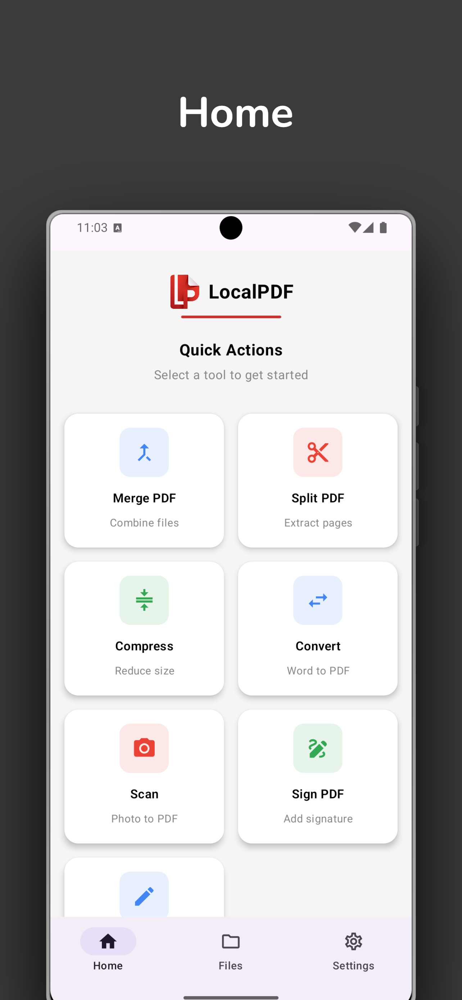
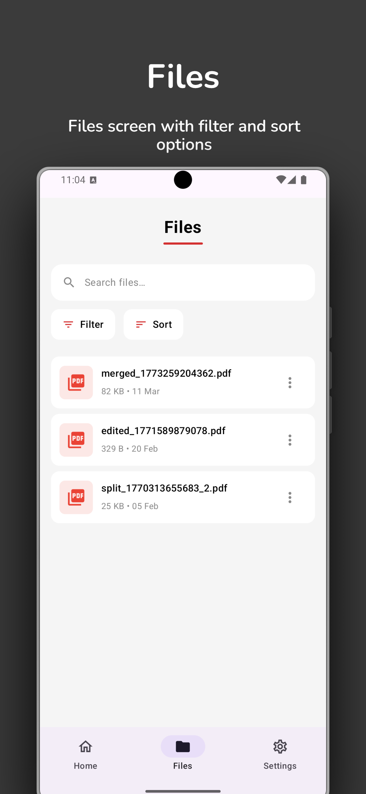
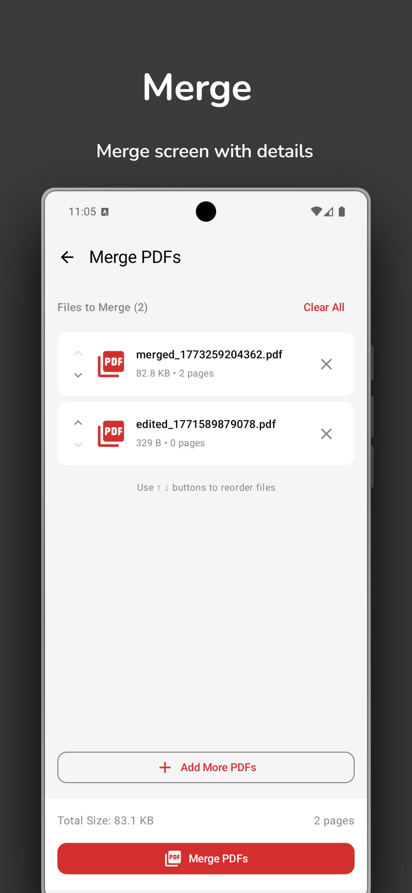
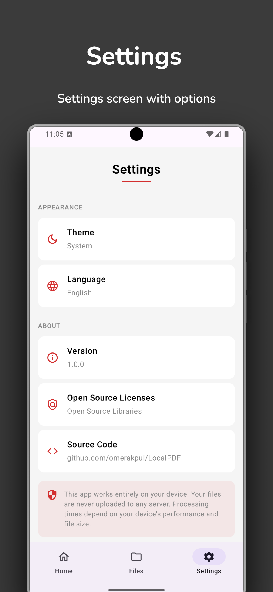

# LocalPDF 📄

<p align="center">
  
  
  
  
  
</p>

A powerful, entirely **offline** Android PDF utility application built with modern Android development practices. LocalPDF allows users to perform various complex PDF operations directly on their device without the need for an internet connection, ensuring complete data privacy.

## 📱 Download APK
You can download the latest APK from the [Releases](../../releases) section and test the application directly on your Android device.

## ✨ Features

* **In-App PDF Viewer:** Fast and smooth PDF rendering with pinch-to-zoom capabilities.
* **Merge PDFs:** Combine multiple PDF documents into a single file easily.
* **Split PDFs:** Extract specific pages or split a PDF into smaller parts.
* **Compress PDFs:** Reduce the file size of your PDFs for easier sharing.
* **Convert:** Bi-directional conversion between PDF and Word documents.
* **Photo to PDF:** Select multiple images from your gallery and convert them into a single PDF document.
* **Sign PDF:** Add digital signatures or draw your signature directly onto PDF pages.
* **Edit PDF:** Rotate or delete specific pages within a PDF document.
* **File Management:** Built-in file explorer to manage, rename, and delete generated PDFs.

## 🛠 Tech Stack & Architecture

* **UI:** Jetpack Compose (Modern, declarative UI toolkit) + Navigation Compose
* **Architecture:** MVVM (Model-View-ViewModel) + Clean Architecture concepts
* **Language:** Kotlin
* **Asynchrony:** Coroutines & StateFlow / SharedFlow
* **Dependency Injection:** Dagger Hilt
* **Local Storage:** Room Database
* **PDF / Document Processing:**
  * Apache PDFBox (Android port) for core PDF manipulations
  * Apache POI for Word-PDF conversion
* **UI State Management:** Robust error handling and loading states managed gracefully via StateFlow and compose `LaunchedEffect` (with Snackbars).
* **Optimization:** ProGuard / R8 configured for aggressive code shrinking and obfuscation in release builds.

## 📸 Screenshots

<p align="center">
  
  
  
  
</p>

## 🚀 Getting Started

### Prerequisites
* Android Studio (Latest Version Recommended)
* JDK 17
* Minimum SDK: Android 8.0 (API 26) or higher

### Installation
1. Clone this repository:
```bash
git clone https://github.com/yourusername/LocalPDF.git
```
2. Open the project in Android Studio.
3. Build and run the application on an emulator or a physical device.

## 🛡️ License
This project is licensed under the MIT License - see the [LICENSE](LICENSE) file for details.
